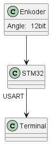
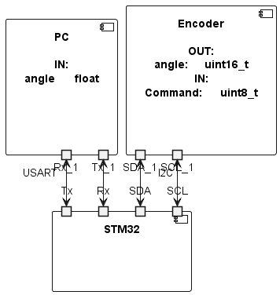
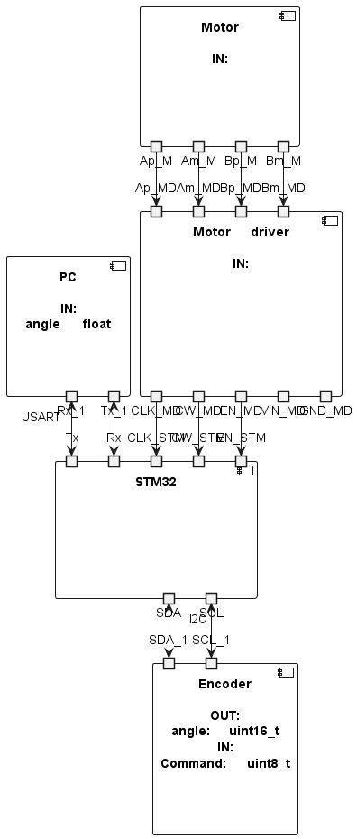
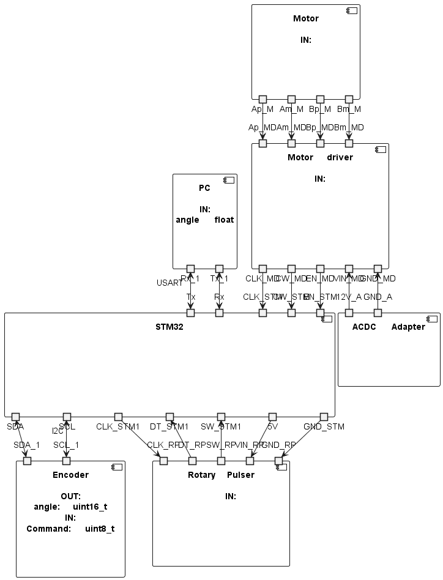

# Inverted Pendulum

Project of regulation system for angle indicator based on STM32. Software is developed in STM32CUBEIDE. Based on Doxygen documentation and with report written under link in [Overleaf](https://www.overleaf.com/read/czjpmjzbdcst#1883af)

## Genesis

Project orginally intended to be regulation system for inverted pendulum but after considerations and thoughts it was decided to create angle indicator object, so name was kept because of first willingnesses.

# Changelog

- 2024-01-07 -- 0.0.0 *3e155d3288b4f657afef73313a0b35f8e921f397*
  - Startup of git repo and files for first report - intended project inside **99_Docs**
- 2024-01-12 -- 0.0.1

  - First STM32 project f7 *6beead79fa8c4a1964a4da42fb8173cefa5bc9f0*
  - Working encoder with other docs and dirs in *c2145cc4f6f6da2d60d8e3a2ba89a5eab47df57c* 
  
    |||
    |:|:|
    

- 2024-01-13 -- 0.0.2 *7db44f939e88d2844e0b40e8b09f601d9aa35a1b*

  - Working motor
  - Included CMSIS libraries with depend path
    

    **GUESS WE HAVE FINALLY LEARNT GITHUB IN ELEMNTARY STAGE**

- 2024-01-13 -- 0.0.3 *6b099ec36c931bc4c4198eabd26bcc16bb355635*

  - Rotary Pulser working
  - UART Menu working
  - Created .gitignore
  

- 2024-01-14 -- 0.0.4 *93b17a49f9529b52d96c81f7fcc80cd89be91956*

  - Simple control of 2 state controller added
  - Variables moved to structures
  - Added better looking MENU in terminal

- 2024-01-5 -- 0.0.5 

  - PID working on fixed gains
  - Motor structure created
  - Handling errors by HAL_OK
  - Button needs to be pressed to power on the motor

# TODO
- [x] START/STOP functions for motor
- [x] move variables to structures
- [x] PID
- [ ] Let user write in parameters of PID via UART
- [ ] Desktop APP in MATLAB
- [ ] SD CARD reader for logs
- [ ] CRC sum
- [ ] Ethernet communication
- [ ] connect LCD